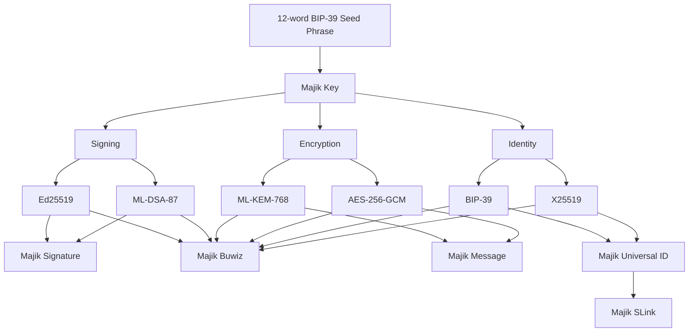

# Majikah — Post-Quantum Security for Your Entire Digital Life

> **One 12-word phrase. Five products. Complete post-quantum protection — for what you send, what you create, and what you own.**

We are a privacy-first technology company building a suite of post-quantum cryptographic tools for individuals, professionals, and developers. In an era of *Harvest Now, Decrypt Later* (HNDL) attacks, we build tools that ensure your data remains secure — not just today, but in the post-quantum future.

---

## Core Philosophy

Identity shouldn't be tied to centralized registries like phone numbers or emails. We empower users with the **Majik Key** — a sovereign, BIP-39 mnemonic-based cryptographic identity that eliminates social graph exposure, single points of failure, and centralized control.

Every Majikah product is built on the same foundation:

| Capability | What it protects | Algorithms |
|---|---|---|
| **Encryption** | Everything you send | ML-KEM-768 (FIPS-203) + X25519 |
| **Signing** | Everything you create | ML-DSA-87 (FIPS-204) + Ed25519 |
| **Identity** | Everything you own | BIP-39 derivation — locally generated, never transmitted |

One seed phrase generates all three. No accounts. No emails. No central authority.

---

## The Majik Key

> Your Majik Key is generated entirely offline. No network request is made during key creation — verifiable in source code.

---

## The Majikah Suite

### 🔐 [Majik Message](https://message.majikah.solutions) — Flagship
**Post-quantum encrypted messaging. No phone number. No email. Just your 12 words.**

Majik Message is a zero-trust, post-quantum encrypted messaging platform using NIST-standardized ML-KEM-768 (FIPS-203). Create accounts with a 12-word seed phrase — no personal data required. Messages are quantum-safe today and will remain secure in 2040+.

**Dual-Protocol Architecture**

| | Real-Time Chats (Ephemeral) | Persistent Threads (Immutable) |
|---|---|---|
| **Integrity Model** | Non-chained | SHA-256 hash chain |
| **Expiration** | 24h auto-purge | Permanent until consensus deletion |
| **Deletion** | Unilateral / self-destruct | N-of-N collaborative consensus |
| **Encryption** | ML-KEM-768 + X25519 + AES-256-GCM | ML-KEM-768 + X25519 + AES-256-GCM |
| **Groups** | Up to 25 members | Up to 25 members |

**Available on:**
[Web App](https://message.majikah.solutions) · [Microsoft Store](https://apps.microsoft.com/detail/9pmjgvzzjspn) · [Chrome Extension](https://chromewebstore.google.com/detail/majik-message/dhlafmkpgjagkhiokoighjaakajbckck) · PWA

[Read Docs](https://majikah.solutions/products/majik-message/docs) · [Official Repository](https://github.com/Majikah/majik-message) · [npm Package](https://www.npmjs.com/package/@majikah/majik-message)

---

### ✍️ [Majik Signature](https://majikah.solutions/products/majik-signature)
**Post-quantum cryptographic file signing and verification.**

Sign any file — documents, photographs, videos, invoices — with a hybrid Ed25519 + ML-DSA-87 signature. Verification requires no account: anyone can verify authenticity with a single drag-and-drop.

**Available on:** [Web App](https://majikah.solutions/products/majik-signature) · Microsoft Store

---

### 🧾 [Majik Buwiz](https://majikah.solutions/products/majik-buwiz)
**Offline-first invoice management with cryptographic signing by default.**

A free, privacy-respecting invoice management tool for freelancers, consultants, and small businesses. Every invoice is post-quantum signed using the user's Majik Key — producing tamper-proof, verifiable records with no internet connection required for core functionality.

**Available on:** Microsoft Store · Web App *(coming soon)*

---

### 🪪 [Majik Universal ID](https://majikah.solutions/products/majik-universal-id)
**Your permanent, self-sovereign public identity.**

A cryptographically verifiable public identity derived entirely from your Majik Key. No platform controls it. Share your Universal ID so anyone can instantly verify your files, documents, and online presence — without trusting a third-party badge.

**Available on:** [Web App](https://majikah.solutions/products/majik-universal-id)

---

### 🔗 [Majik SLink](https://majikah.solutions/products/majik-slink)
**Cryptographic proof of URL and online profile ownership.**

Prove you own any URL — YouTube channels, social profiles, websites — with a signature from your Majik Key. Anyone can verify ownership without relying on a platform badge, a verification service, or a centralized authority.

**Available on:** [Web App](https://majikah.solutions/products/majik-slink)

---

## Platform Availability

| Platform | Message | Signature | Buwiz | Universal ID | SLink |
|---|:---:|:---:|:---:|:---:|:---:|
| Web App | ✅ | ✅ | 🔜 | ✅ | ✅ |
| Windows (Microsoft Store) | ✅ | ✅ | ✅ | — | — |
| PWA | ✅ | — | — | — | — |
| Chrome Extension | ✅ | — | — | — | — |

---

## The Hybrid Encryption Stack

We use a defense-in-depth approach — running both classical and post-quantum algorithms in parallel. If either is ever compromised, the other continues to protect you.

| Component | Purpose |
|---|---|
| **ML-KEM-768 (FIPS-203)** | Post-quantum key encapsulation — quantum-safe encryption |
| **ML-DSA-87 (FIPS-204)** | Post-quantum digital signatures — quantum-safe file signing |
| **X25519** | Classical key exchange — hybrid key agreement |
| **Ed25519** | Classical digital signatures — hybrid signing |
| **AES-256-GCM** | Symmetric payload encryption |
| **Argon2id (64 MB)** | Memory-hard KDF — GPU/ASIC-resistant key derivation |
| **BIP-39** | Mnemonic seed phrase standard — sovereign identity derivation |

---

## Open Source SDK Family

All Majikah cryptographic SDKs are published under **Apache 2.0**. Every line of cryptographic code is publicly auditable.

| Package | Description |
|---|---|
| [`@majikah/majik-key`](https://github.com/Majikah/majik-key) | Core key generation, BIP-39 derivation, ML-KEM-768 + Ed25519 key management |
| [`@majikah/majik-message`](https://github.com/Majikah/majik-message) | Message encryption, decryption, and protocol implementation |
| [`@majikah/majik-envelope`](https://github.com/Majikah/majik-envelope) | Post-quantum envelope format — multi-recipient key encapsulation |
| [`@majikah/majik-file`](https://github.com/Majikah/majik-file) | Post-quantum file encryption — produces self-contained `.mjkb` binary files |
| [`@majikah/majik-bytes`](https://github.com/Majikah/majik-bytes) | Cryptographic byte operations and encoding utilities |
| [`@majikah/majik-contact`](https://github.com/Majikah/majik-contact) | Contact management and key exchange primitives |

All packages: [`npmjs.com/~majikah`](https://www.npmjs.com/~majikah)

Built on battle-tested, independently audited libraries: **@stablelib**, **@noble/post-quantum**, **@noble/hashes**.

---

## Developer Platform

We provide a dedicated developer platform for teams and individuals who want to integrate Majikah's cryptographic capabilities into their own products.

🔗 **[developers.majikah.solutions](https://developers.majikah.solutions)**

- Early access program enrollment
- Full SDK documentation and API references
- Integration guides and examples

---

## Majikah vs. Traditional Tools

| | Traditional Tools | Majikah |
|---|---|---|
| Encryption | Vulnerable to quantum (Shor's algorithm) | ML-KEM-768 — quantum-safe by design |
| Account creation | Phone number or email required | 12-word seed phrase only — zero personal data |
| File authenticity | No cryptographic proof | Post-quantum signatures on every file |
| Identity ownership | Controlled by platforms | Self-sovereign — your key, your device |
| Breach risk | Centralized directory exposed | Zero-knowledge relay — nothing to breach |
| Device portability | Locked to one device | 12-word phrase restores everything, anywhere |

---

## Trust & Credentials

- 🏛️ **NIST FIPS-203** — ML-KEM-768 is an official post-quantum standard
- 🏛️ **NIST FIPS-204** — ML-DSA-87 is an official post-quantum standard
- 🔓 **Apache 2.0 Open Source** — all SDKs are publicly auditable on GitHub
- ☁️ **Google Cloud for Startups** — infrastructure program member
- 🔴 **Redis® for Startups** — infrastructure program member
- 📴 **Offline key generation** — verifiable in source code; no network call made during key creation
- 🔑 **BIP-39** — the same widely-audited standard used by hardware wallets worldwide

---

## Security Note

Majik Message **does not protect against device compromise or endpoint malware**.

For stronger operational privacy:
- Use a **VPN** or **Tor** if you require IP anonymity.
- User IP addresses **may be visible to the relay infrastructure**.
- Majikah products are not a substitute for legal counsel, operational security training, or organizational security policies.

Thread integrity can be independently verified at: [message.majikah.solutions/threads/validate](https://message.majikah.solutions/threads/validate)

---

## Connect

| | |
|---|---|
| **Website** | [majikah.solutions](https://majikah.solutions) |
| **Majik Message** | [message.majikah.solutions](https://message.majikah.solutions) |
| **Developer Platform** | [developers.majikah.solutions](https://developers.majikah.solutions) |
| **GitHub** | [github.com/Majikah](https://github.com/Majikah) |
| **npm** | [npmjs.com/~majikah](https://www.npmjs.com/~majikah) |
| **Inquiries** | Majikah Information Technology Solutions |

---

  <strong>Post-quantum security for everyone.</strong> 
  One key. Five products. Zero compromises.  
  <a href="https://majikah.solutions">majikah.solutions</a>

